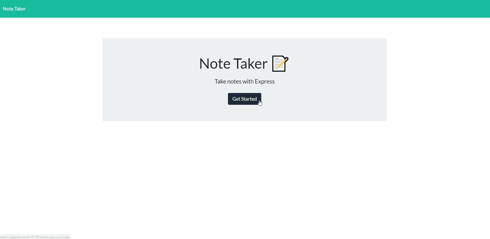

# Note-Taker

## Summary
This site contains a note taker application that takes in user input and saves it in the application. When a user lands on the site, the application loads a welcome message where the user can then click on "get started" to start the application. Once the user starts the application, the user can then write a title of the note then write a description of the note. When the user is done entering the description of the note, the user then proceeds to save the note and the note title appears on the left side of the application. The user can proceed to add as many notes as desired and they will all be saved to the left side of the application. 

All notes saved will remain saved in the application if it gets reloaded. A cool feature the application contains is being able to delete notes. Every time a user enters a note, a delete button is attached to the note. The user can proceed to click on the delete button and the note will be deleted. If the user is displaying an existing note and wants to start a new note, the user just needs to click on the pencil icon and the user will be able to start a new note. This is a great application for writing notes or ideas or just anything the user wants to write down and not forget.   

## Site

## Technologies Used
* HTML - Used for displaying the outcome of the application
* Javascript - Used to write in Node
* Package.json - Used to identify the project and the dependencies
* Package-lock.json - Automatically created for operations where npm modifies  package.json
* Node.js - Used to to write server-side application
* Npm - Used to obtain software packages
* Express - Node web framework
* CSS - Used for styling HTML
* UUID - Software package used for id's
* Huroku - Used for deploying the application
* GitHub - Used as the repository

## Code Snippet

